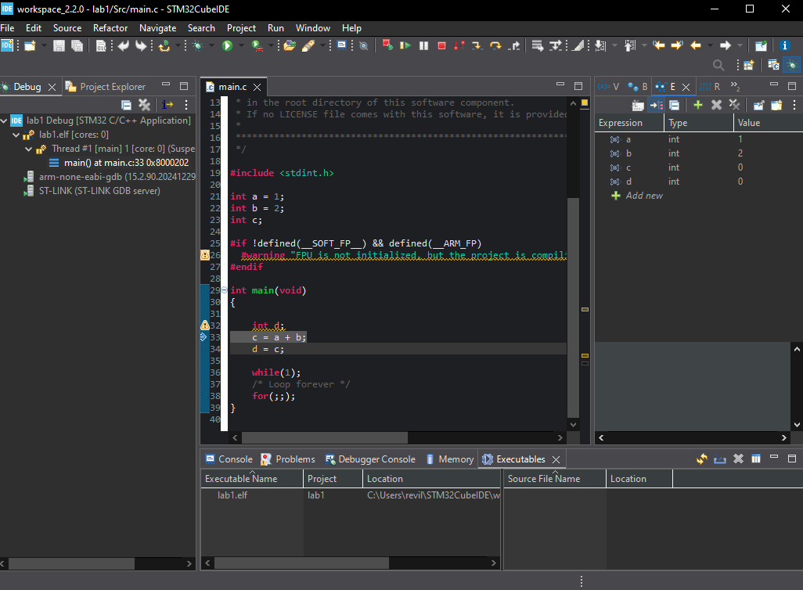
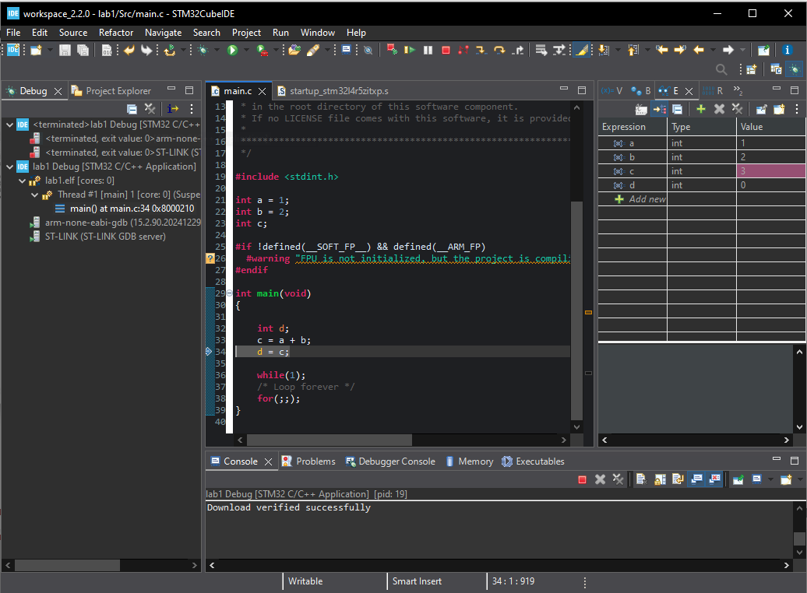

# Lab1

#Part 2 - Flashing & Debugging Code 
1. As the code begins to The LD 4 on the STM32 flashes green and red and creates new folders, a debugging window on the right is opened up where you can add variable expressions to watch. A debug folder is made. To look at what part of memory is written to on the MCU you can look at the map file, under the "Linker script and memory map" section. A USB cord is used to connect/communicate to your STM32 board from your computer, we also had to install USB drivers when installing the application to recongnize this specific USB connection, and the communcation/connection updates are outputted in the console. 

What tool or protocol is used to transfer the compiled binary to the microcontroller?

2.  - BEFORE 
 - AFTER

#Part 3 - Blinking LEDS

What user LEDs are available on the NUCLEO-L4R5ZI-P board?
2. What are the pin names (e.g., PA5, PB13, etc.) associated with each LED?
3. Are these pins configured as GPIOs? What does that mean?
4. Should they be configured as input or output? Why?

1. There are three USER LEDS, LD1-3. These are connected to the MCUs GPIO pins which lets us turn them off or on using software. They are memory-mapped, so the MCU can read them as if they are a memory address. Pin names: PC7 (green), PB7 (blue), PB14(red)
2.
3.
4.

## Video

[Watch or download IMG_3378.MOV](3-blink/IMG_3378.MOV)